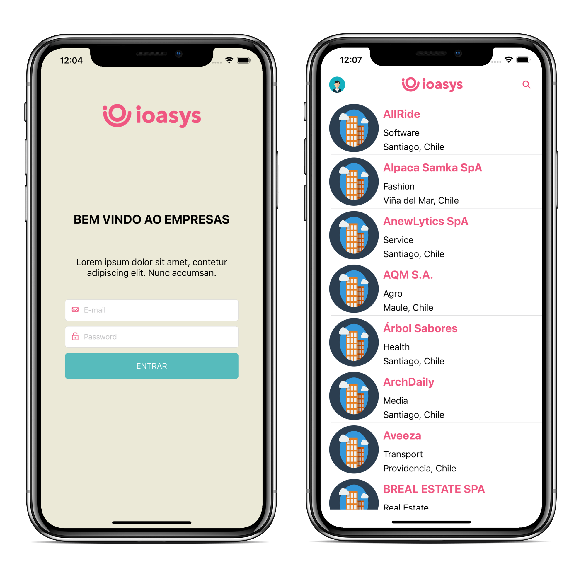
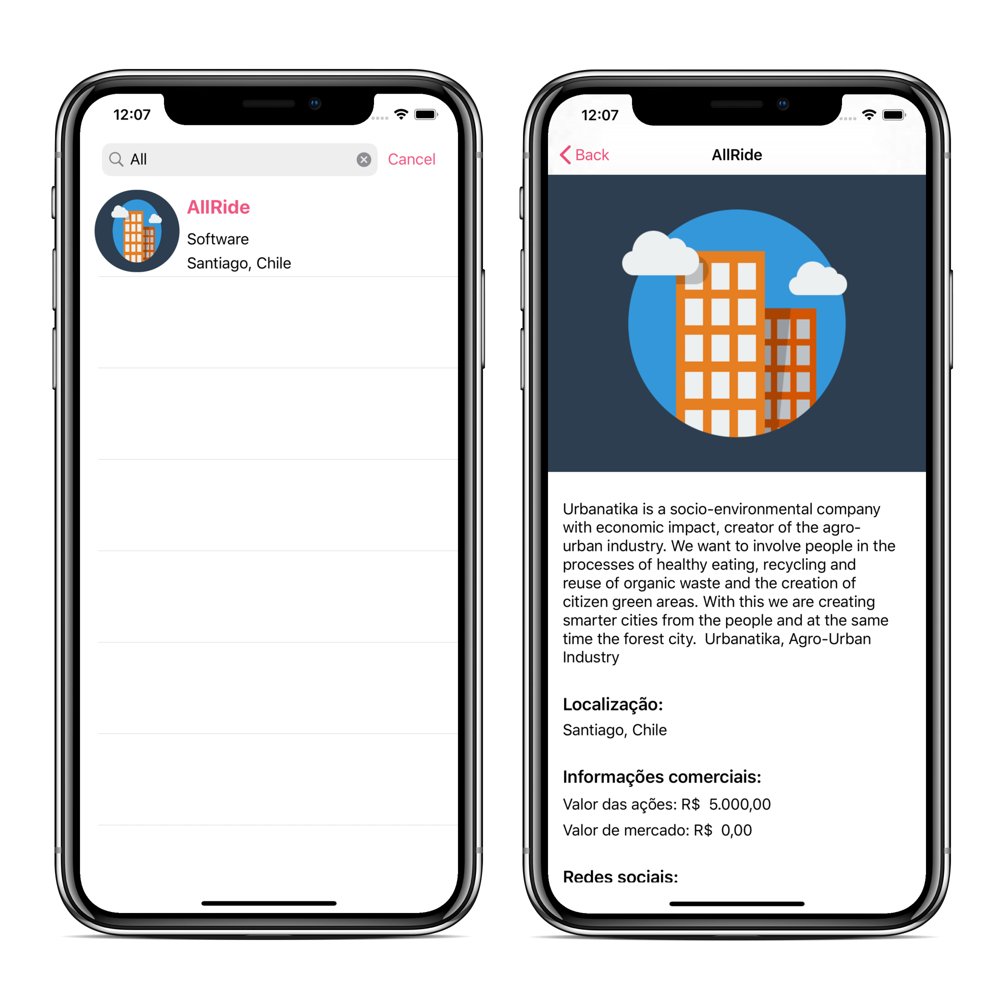

# Implementação neste repositório

## Screenshots

## Frameworks, ferramentas e linguagens:

- Swift 5/XCode 11
- CocoaPods para gerenciamento de dependências
- Alamofire (requisições REST)
- Kingfisher (Download de imagens)
- ObjectMapper (mapeamento de JSON para objetos Swift)
- Padrão de projeto Coordinator
- Classes customizadas para requisição (RequestHandlers)

# Dados originais do desafio #

Estes documento README tem como objetivo fornecer as informações necessárias para realização do projeto Empresas.

### O QUE FAZER ? ###

* Você deve fazer um fork deste repositório, criar o código e ao finalizar, enviar o link do seu repositório para a nossa equipe. Lembre-se, NÃO é necessário criar um Pull Request para isso.
* Nós iremos avaliar e retornar por email o resultado do seu teste.

### ESCOPO DO PROJETO ###

* Deve ser criado um aplicativo iOS utilizando Objective C ou Swift com as seguintes especificações:
* Login e acesso de Usuário já registrado
	* Para o login usamos padrões OAuth 2.0. Na resposta de sucesso do login a api retornará 3 custom headers (access-token, client, uid);
	* Para ter acesso as demais APIS precisamos enviar esses 3 custom headers para a API autorizar a requisição;
* Listagem de Empresas
* Detalhamento de Empresas

* Temos um framework muito completo que pode te ajudar em tudo: https://github.com/JotaMelo/iOSHelpers-Swift ou https://github.com/JotaMelo/iOSHelpers
